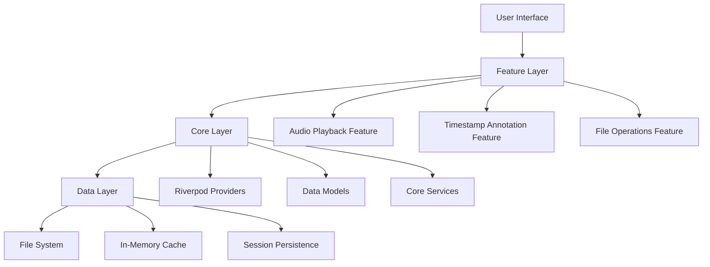
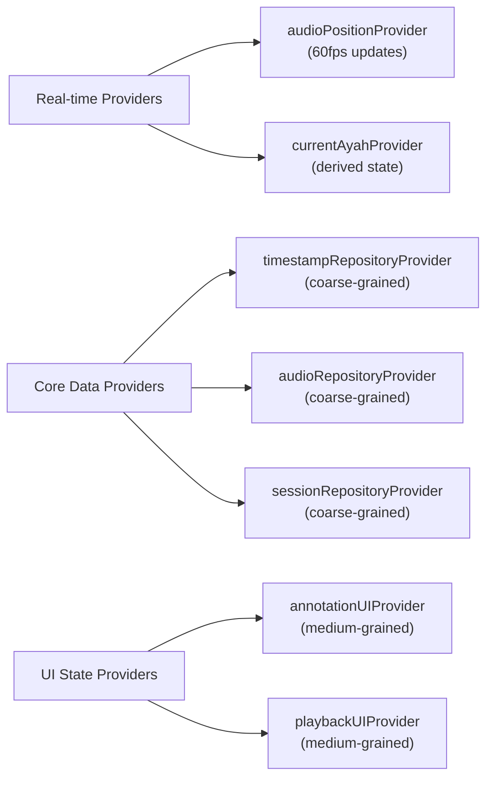
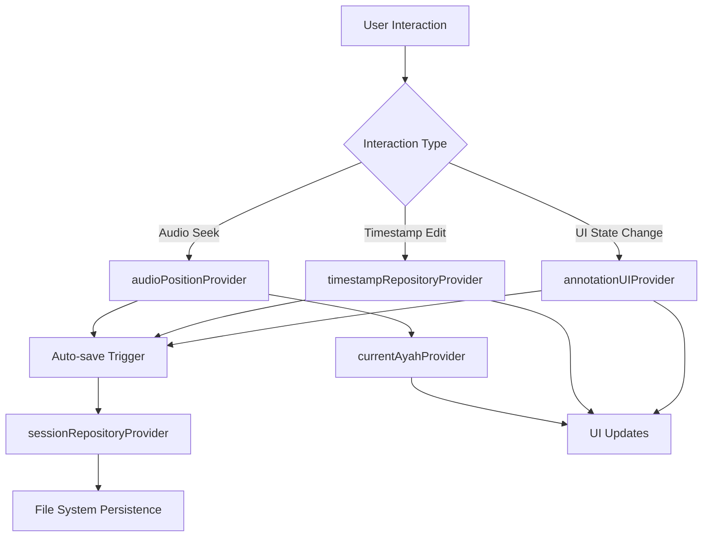
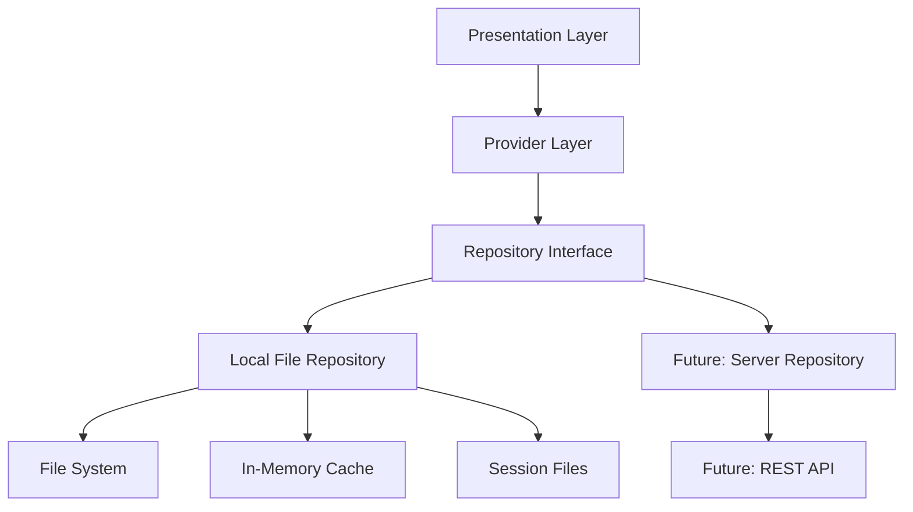
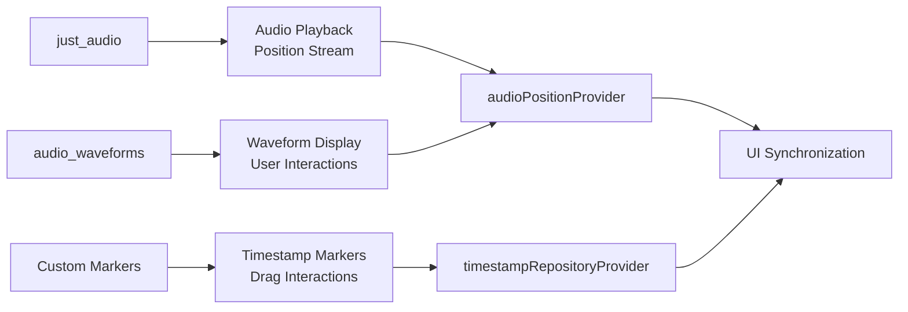
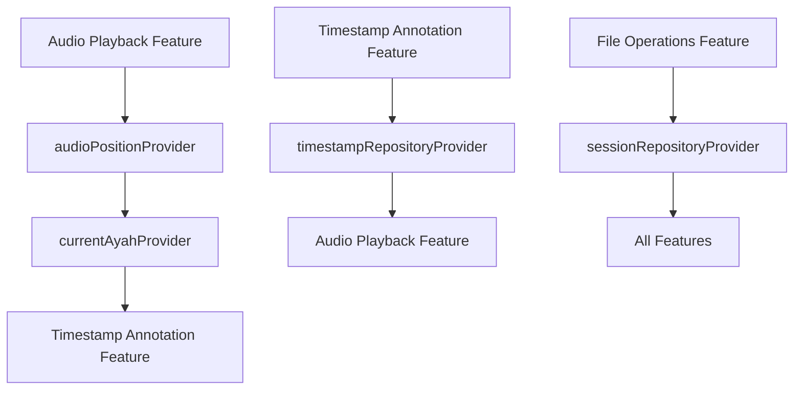

<!-- Generated by SpecStory -->

# Architecture Decisions (2025-07-20 09:43Z)

_**User**_

I want you to verify that ALL the logic that's mentioned here : #file:2025-07-20_08-08Z-best-practices-for-documenting-a-flutter-app.md:90-133  is also mentioned in these files  : #file:project_requirements.md  , #file:features.md  , to make sure everything got documented right

---

_**Assistant**_

I'll carefully compare the original logic from your specification with the documentation files to verify that all requirements are captured correctly. Now let me analyze the original specification and cross-reference it with both documentation files to identify any missing elements.

## Analysis Results

After carefully comparing the original specification with both documentation files, I found that **all the major logic and requirements are properly documented**. However, there are a few minor details and nuances that could be made more explicit:

### ✅ **Fully Covered Requirements:**

1. **Core Inputs**: All three inputs (audio file, ayah timestamps, optional word timestamps) are documented
2. **Audio Player Functionality**: Waveform display, playback controls, real-time display are all covered
3. **Real-time Display**: Current timestamp, current ayah, word highlighting/dimming are documented
4. **Option 1**: Bulk timestamp replacement with future YouTube integration is documented
5. **Option 2 Core Features**: Card display system, sync/unsync functionality, draggable markers are covered
6. **Timestamp Conflict Resolution**: Overlap detection and automatic adjustment are documented
7. **Batch Processing**: Multiple ayah changes with proper sorting by ayah number is covered
8. **Option 3**: Future requirements placeholder is documented

### ⚠️ **Minor Details That Could Be More Explicit:**

1. **"Change Timestamp" vs "Change Timestamps"**: 
   - Original spec mentions both singular and plural forms
   - Documentation uses both but could clarify when each appears

2. **Button Positioning**:
   - Original: "Change Timestamp" button appears "next to the sync to Ayah button"
   - Documentation mentions the button but doesn't specify exact positioning

3. **Waveform Bar Movement**:
   - Original: "move the 2 thin bars of the waveform accordingly" when editing timestamps in cards
   - This detail is implied but not explicitly stated in the documentation

4. **Cache Mechanism**:
   - Original mentions "changes stored in the cache"
   - Documentation describes the functionality but doesn't explicitly use the term "cache"

### **Recommendation:**

The documentation is **comprehensive and accurate**. These minor details don't affect the core functionality understanding, but if you want perfect alignment, we could add a few clarifying sentences to make these nuances more explicit. The current documentation successfully captures all the essential logic and requirements from your original specification.

Would you like me to make any adjustments to add these minor details for complete alignment?

---

_**User**_

ok, suppose i have the current #file:features.md  file, and i want to create an architecutre.md file ; given the feature file and the small details mentioned above, and the #file:project_requirements.md file , let's turn this chat into a brainstorming session where we decide architectural choices bit by bit. I.e., in each step, you suggest the possible paths, and i choose , then we do this for all steps , then when we're done, i'll tell you to create the architecture.md file based on our chat 

---

_**Assistant**_

Great! Let's brainstorm the architecture systematically. I'll present you with architectural decisions to make, starting with the high-level choices and working our way down to implementation details.

## Step 1: Overall Architecture Pattern

For a Flutter app with audio processing, real-time UI updates, and complex state management, we have several architectural patterns to choose from:

**Option A: Clean Architecture + BLoC**
- Presentation Layer (UI) → Business Logic Layer (BLoC) → Data Layer (Repositories)
- Great for testability and separation of concerns
- BLoC handles complex state management well
- More boilerplate but very maintainable

**Option B: MVVM + Provider/Riverpod**
- Model-View-ViewModel pattern
- Provider/Riverpod for state management
- Simpler than Clean Architecture
- Good balance between structure and complexity

**Option C: MVC + GetX**
- Model-View-Controller pattern
- GetX for state management, routing, and dependency injection
- Less boilerplate, faster development
- All-in-one solution but more opinionated

**Option D: Feature-First + Riverpod**
- Organize by features rather than layers
- Each feature has its own presentation, business logic, and data layers
- Great for scalability and team collaboration
- Modern approach, very maintainable

Which architectural pattern appeals to you for this project? Consider factors like:
- Team size and experience
- Long-term maintainability needs
- Testing requirements
- Development speed preferences

What's your choice for the overall architecture pattern?

---

_**User**_

give a very small dummy code example for each option 
(i.e., the bare minimum , write comments etc, write very few code just for me to get the idea)

---

_**Assistant**_

Here are minimal code examples for each architectural pattern to help you understand the differences:

## Option A: Clean Architecture + BLoC

````dart
// Domain Layer - Core business logic
abstract class AudioRepository {
  Stream<AudioState> playAudio(String path);
  Future<List<AyahTimestamp>> getTimestamps();
}

// Business Logic Layer
class AudioPlayerBloc extends Bloc<AudioEvent, AudioState> {
  final AudioRepository _repository;
  
  AudioPlayerBloc(this._repository) : super(AudioInitial()) {
    on<PlayAudio>(_onPlayAudio);
    on<UpdateTimestamp>(_onUpdateTimestamp);
  }
  
  void _onPlayAudio(PlayAudio event, Emitter<AudioState> emit) async {
    // Business logic here
    emit(AudioPlaying(currentTime: event.position));
  }
}

// Presentation Layer
class AudioPlayerWidget extends StatelessWidget {
  @override
  Widget build(BuildContext context) {
    return BlocBuilder<AudioPlayerBloc, AudioState>(
      builder: (context, state) {
        if (state is AudioPlaying) {
          return Text('Playing: ${state.currentTime}');
        }
        return CircularProgressIndicator();
      },
    );
  }
}
````

## Option B: MVVM + Provider

````dart
// Model
class AudioModel {
  final String audioPath;
  final List<AyahTimestamp> timestamps;
  final Duration currentPosition;
  
  AudioModel({required this.audioPath, required this.timestamps, required this.currentPosition});
}

// ViewModel
class AudioPlayerViewModel extends ChangeNotifier {
  AudioModel _model = AudioModel(audioPath: '', timestamps: [], currentPosition: Duration.zero);
  
  AudioModel get model => _model;
  
  void playAudio() {
    // Update model and notify listeners
    _model = _model.copyWith(currentPosition: Duration(seconds: 10));
    notifyListeners();
  }
  
  void updateTimestamp(int ayahNumber, Duration newTimestamp) {
    // Business logic for timestamp updates
    notifyListeners();
  }
}

// View
class AudioPlayerView extends StatelessWidget {
  @override
  Widget build(BuildContext context) {
    return Consumer<AudioPlayerViewModel>(
      builder: (context, viewModel, child) {
        return Column(
          children: [
            Text('Current: ${viewModel.model.currentPosition}'),
            ElevatedButton(
              onPressed: viewModel.playAudio,
              child: Text('Play'),
            ),
          ],
        );
      },
    );
  }
}
````

## Option C: MVC + GetX

````dart
// Model
class AudioData {
  final String path;
  final RxList<AyahTimestamp> timestamps = <AyahTimestamp>[].obs;
  final Rx<Duration> currentPosition = Duration.zero.obs;
}

// Controller
class AudioController extends GetxController {
  final AudioData _audioData = AudioData();
  
  // Getters for reactive UI
  List<AyahTimestamp> get timestamps => _audioData.timestamps;
  Duration get currentPosition => _audioData.currentPosition.value;
  
  void playAudio() {
    // Business logic
    _audioData.currentPosition.value = Duration(seconds: 15);
  }
  
  void updateTimestamp(int ayahIndex, Duration newTime) {
    _audioData.timestamps[ayahIndex] = _audioData.timestamps[ayahIndex].copyWith(startTime: newTime);
  }
}

// View
class AudioPlayerPage extends StatelessWidget {
  final AudioController controller = Get.put(AudioController());
  
  @override
  Widget build(BuildContext context) {
    return Obx(() => Column(
      children: [
        Text('Playing: ${controller.currentPosition}'),
        ElevatedButton(
          onPressed: controller.playAudio,
          child: Text('Play'),
        ),
      ],
    ));
  }
}
````

## Option D: Feature-First + Riverpod

````dart
// Feature: audio_player/
// audio_player/providers/audio_provider.dart
final audioPlayerProvider = StateNotifierProvider<AudioPlayerNotifier, AudioPlayerState>((ref) {
  return AudioPlayerNotifier(ref.read(audioRepositoryProvider));
});

class AudioPlayerNotifier extends StateNotifier<AudioPlayerState> {
  final AudioRepository _repository;
  
  AudioPlayerNotifier(this._repository) : super(AudioPlayerState.initial());
  
  void playAudio() {
    state = state.copyWith(isPlaying: true, currentPosition: Duration(seconds: 5));
  }
  
  void updateTimestamp(int ayahIndex, Duration newTimestamp) {
    final updatedTimestamps = [...state.timestamps];
    updatedTimestamps[ayahIndex] = updatedTimestamps[ayahIndex].copyWith(startTime: newTimestamp);
    state = state.copyWith(timestamps: updatedTimestamps);
  }
}

// audio_player/widgets/audio_player_widget.dart
class AudioPlayerWidget extends ConsumerWidget {
  @override
  Widget build(BuildContext context, WidgetRef ref) {
    final audioState = ref.watch(audioPlayerProvider);
    
    return Column(
      children: [
        Text('Position: ${audioState.currentPosition}'),
        ElevatedButton(
          onPressed: () => ref.read(audioPlayerProvider.notifier).playAudio(),
          child: Text('Play'),
        ),
      ],
    );
  }
}
````

## Key Differences Summary:

- **Clean Architecture + BLoC**: Most structured, best for large teams, lots of boilerplate
- **MVVM + Provider**: Good balance, familiar pattern, moderate boilerplate  
- **MVC + GetX**: Fastest development, least boilerplate, all-in-one solution
- **Feature-First + Riverpod**: Modern approach, great for scaling, organized by features

Which approach feels most comfortable for your project needs and team experience?

---

_**User**_

tell me more about feature-first + Riverpod as if i don't know anything about architecture patterns, then tell me why i might prefer it (don't write code this time, just details) 

---

_**Assistant**_

## What is Feature-First Architecture?

**Feature-First** is a way of organizing your code based on **what your app does** rather than **how it's structured technically**.

### Traditional Approach (Layer-First):
Imagine organizing your closet like this:
- One drawer for ALL shirts (regardless of season/occasion)
- One drawer for ALL pants 
- One drawer for ALL accessories

Your code would be organized like:
```
lib/
├── models/          (all data structures)
├── views/           (all UI screens)
├── controllers/     (all business logic)
└── services/        (all external APIs)
```

### Feature-First Approach:
Now imagine organizing your closet by **purpose**:
- Work clothes section (shirts, pants, ties all together)
- Gym clothes section (everything needed for workouts)
- Casual clothes section (complete casual outfits)

Your code gets organized like:
```
lib/
├── features/
│   ├── audio_player/
│   │   ├── models/
│   │   ├── widgets/
│   │   ├── providers/
│   │   └── services/
│   ├── timestamp_editor/
│   │   ├── models/
│   │   ├── widgets/
│   │   ├── providers/
│   │   └── services/
│   └── file_manager/
│       ├── models/
│       ├── widgets/
│       ├── providers/
│       └── services/
```

## What is Riverpod?

**Riverpod** is Flutter's modern state management solution. Think of it as a smart assistant that:

### 1. **Manages Your App's Memory**
- Keeps track of what data your app needs
- Automatically cleans up data when it's no longer needed
- Prevents memory leaks

### 2. **Handles Dependencies Intelligently**
- If Feature A needs data from Feature B, Riverpod automatically connects them
- If Feature B updates, all dependent features get notified automatically
- No manual wiring needed

### 3. **Provides Reactive Updates**
- When your audio position changes, only the widgets that care about audio position rebuild
- Your timestamp cards don't rebuild unnecessarily when audio plays
- Very efficient performance

### 4. **Makes Testing Easy**
- You can easily mock any piece of data for testing
- Each feature can be tested in isolation
- No complex setup needed

## Why You Might Prefer Feature-First + Riverpod

### **1. Mental Model Matches Your App**
When you think "I need to fix the audio player," you go directly to the `audio_player/` folder. Everything related to audio playing is there - no hunting across multiple folders.

### **2. Team Collaboration**
- Developer A works on timestamp editing
- Developer B works on file management  
- They rarely conflict because they're working in separate feature folders
- Easy to assign ownership of features

### **3. Easier Maintenance**
When you need to add "export timestamps" functionality:
- Traditional: You'd modify files in models/, views/, controllers/, and services/ folders
- Feature-First: You'd work mainly in the `file_manager/` feature folder
- All related code is co-located

### **4. Scalability**
Adding new features (like "YouTube integration") means creating a new feature folder. Your existing features remain untouched and unaffected.

### **5. Modern Flutter Best Practices**
- Riverpod is created by the same person who made Provider (Flutter's previous state management)
- It's designed specifically to solve Provider's limitations
- It's the direction the Flutter community is moving toward

### **6. Built-in Performance Optimizations**
- Riverpod automatically prevents unnecessary rebuilds
- Your waveform won't redraw when timestamp cards update
- Your timestamp cards won't rebuild when audio position changes (unless they need to)

### **7. Intuitive Learning Curve**
- If you understand "this widget needs this data," Riverpod makes it simple
- Less boilerplate than BLoC
- More structured than GetX
- Less complex than Clean Architecture

### **8. Future-Proof**
- Easy to add new features without touching existing code
- Easy to remove features by deleting folders
- Easy to refactor individual features without affecting others

## For Your Surah Annotator Specifically:

Your app has clear, distinct features:
- **Audio playback** (waveform, controls, real-time updates)
- **Timestamp editing** (cards, drag-to-adjust, batch operations)
- **File management** (import/export, YouTube integration)
- **Synchronization** (keeping UI in sync with audio)

Feature-First means each of these becomes a self-contained module that communicates cleanly with others through Riverpod providers. When you want to add "collaborative editing" later, it becomes a new feature that plugs into your existing system without disrupting anything.

Does this approach appeal to you for your project?

---

_**User**_

ok, let's take a step back: tell me difference between riverpod and provider (as if i don't know either)

---

_**Assistant**_

## What are Provider and Riverpod?

Both **Provider** and **Riverpod** are solutions for **state management** in Flutter. Think of state management as "how your app remembers and shares information between different parts of your app."

### A Simple Analogy
Imagine your app is like a restaurant:
- **State** = Information the restaurant needs to remember (table orders, kitchen status, customer preferences)
- **State Management** = How this information gets shared between the kitchen, waiters, and cashier

Without state management, it's like each waiter keeping their own separate notepad - chaos and inconsistency!

## Provider: The Original Solution

**Provider** was Flutter's first popular state management solution, created by Remi Rousselet.

### How Provider Works:
```
Think of it like a bulletin board system:
1. You pin information to a bulletin board (Provider)
2. Anyone who needs that info can look at the board (Consumer)
3. When info changes, everyone looking at the board gets notified
```

### Provider Characteristics:
- **Simple to understand**: "Put data here, get data there"
- **Widely adopted**: Most Flutter tutorials use Provider
- **InheritedWidget based**: Uses Flutter's built-in system
- **Manual management**: You decide when and how to create/destroy providers

### Provider Limitations:
1. **Memory leaks**: Easy to forget to dispose of resources
2. **Runtime errors**: Typos in provider names cause crashes during app execution
3. **Complex dependencies**: Hard to manage when Feature A needs Feature B needs Feature C
4. **Testing difficulties**: Mocking providers requires complex setup
5. **No compile-time safety**: Errors only show up when the app is running

## Riverpod: The Modern Evolution

**Riverpod** is Provider's successor, also created by Remi Rousselet, designed to fix Provider's problems.

### How Riverpod Works:
```
Think of it like a smart assistant system:
1. You tell the assistant what information you need (Provider)
2. The assistant automatically figures out dependencies and manages lifecycle
3. When you're done with info, the assistant automatically cleans up
4. If something goes wrong, the assistant tells you before the app even runs
```

### Riverpod Improvements:

#### 1. **Compile-Time Safety**
- **Provider**: If you typo a provider name, your app crashes when it tries to use it
- **Riverpod**: Typos are caught immediately while you're coding (like spell-check)

#### 2. **Automatic Memory Management**
- **Provider**: You must remember to dispose of controllers, streams, etc.
- **Riverpod**: Automatically cleans up when no longer needed

#### 3. **Better Testing**
- **Provider**: Complex setup to mock providers for testing
- **Riverpod**: Built-in testing support, very easy to override providers

#### 4. **No Context Required**
- **Provider**: Always need `BuildContext` to access providers
- **Riverpod**: Can access providers from anywhere (services, other providers, etc.)

#### 5. **Better Developer Experience**
- **Provider**: Manual provider setup in widget tree
- **Riverpod**: Automatic dependency injection and resolution

#### 6. **Family Support**
- **Provider**: Difficult to create multiple instances of the same provider
- **Riverpod**: Easy to create provider families (e.g., one provider per ayah)

## Side-by-Side Example (Conceptual)

### Provider Approach:
```
You want to share "current audio position" across your app:

1. Create a ChangeNotifier class
2. Wrap your app with ChangeNotifierProvider
3. Use Consumer widgets everywhere you need the data
4. Remember to dispose of the notifier
5. Hope you didn't make any typos in provider names
```

### Riverpod Approach:
```
You want to share "current audio position" across your app:

1. Create a StateNotifierProvider
2. Use ref.watch() anywhere you need the data
3. Riverpod handles everything else automatically
4. Compile-time errors if you make mistakes
```

## Why Riverpod is Considered Better

### **1. Less Boilerplate**
- Provider: Need to wrap widgets, manage context, handle disposal
- Riverpod: Just declare what you need, use it anywhere

### **2. Fewer Bugs**
- Provider: Runtime crashes from typos or missing providers
- Riverpod: Catches errors before your app even runs

### **3. Better Performance**
- Provider: Sometimes rebuilds widgets unnecessarily
- Riverpod: More granular control over when widgets rebuild

### **4. Future-Proof**
- Provider: In maintenance mode, no major new features
- Riverpod: Actively developed with new features

### **5. Scales Better**
- Provider: Gets complex with multiple interconnected providers
- Riverpod: Handles complex dependency graphs elegantly

## For Your Surah Annotator Project

Given your app's complexity:
- **Audio playback state** needs to be shared with timestamp cards
- **Timestamp editing** affects multiple parts of the UI
- **File operations** need to update various components
- **Future YouTube integration** will need to coordinate with existing features

**Riverpod** would handle these interconnected features more elegantly and safely than Provider.

## The Bottom Line

- **Provider**: Like using a basic notebook to track information - works, but you have to be very careful
- **Riverpod**: Like having a smart digital assistant that prevents mistakes and handles complexity automatically

Most new Flutter projects are choosing Riverpod over Provider for good reason - it's simply a more robust, modern solution.

Does this help clarify the differences and why Riverpod might be the better choice for your project?

---

_**User**_

great, now let's return to the previous task: 

I like what you mentioned in feature-first approach , e.g., :

```txt

lib/
├── features/
│   ├── audio_player/
│   │   ├── models/
│   │   ├── widgets/
│   │   ├── providers/
│   │   └── services/
│   ├── timestamp_editor/
│   │   ├── models/
│   │   ├── widgets/
│   │   ├── providers/
│   │   └── services/
│   └── file_manager/
│       ├── models/
│       ├── widgets/
│       ├── providers/
│       └── services/

```

however, think out loud with me on this conundrum: there are certain times where the audio_player may have widgets doing the logic of timestamp_editor (e.g., the 2 thin bars on the audio waveform should reflect in the timestamps in the timestamp_editor, etc) , in these cases, how should the repo be structured in your opinion?

---

_**Assistant**_

Great question! This is a common challenge in feature-first architecture - **feature boundaries aren't always clean** in real applications. Let me think through this step by step.

## The Conundrum You've Identified

You're absolutely right that there's overlap:
- **Audio player** has draggable timestamp markers (thin bars on waveform)
- **Timestamp editor** has the cards that display/edit the same timestamps
- When you drag a bar in audio_player, it should update the cards in timestamp_editor
- When you edit in timestamp_editor cards, it should move the bars in audio_player

This creates a **circular dependency** problem if we're too strict about feature boundaries.

## Possible Solutions - Let Me Think Through Each:

### Option 1: Shared State Layer
```
lib/
├── core/
│   ├── providers/
│   │   ├── timestamp_state_provider.dart  // Shared timestamp state
│   │   └── audio_state_provider.dart      // Shared audio state
├── features/
│   ├── audio_player/
│   │   ├── widgets/
│   │   │   ├── waveform_widget.dart
│   │   │   └── draggable_markers_widget.dart  // Uses shared timestamp state
│   │   └── services/
│   ├── timestamp_editor/
│   │   ├── widgets/
│   │   │   └── timestamp_cards_widget.dart     // Uses shared timestamp state
│   │   └── services/
```

**Pros:** Clear separation, shared state
**Cons:** Might lead to "god providers" that know about everything

### Option 2: Cross-Feature Dependencies
```
lib/
├── features/
│   ├── audio_player/
│   │   ├── providers/
│   │   │   └── audio_player_provider.dart
│   │   └── widgets/
│   │       └── waveform_with_markers.dart  // Depends on timestamp_editor providers
│   ├── timestamp_editor/
│   │   ├── providers/
│   │   │   └── timestamp_provider.dart
│   │   └── widgets/
│   │       └── timestamp_cards.dart        // Depends on audio_player providers
```

**Pros:** Features can directly communicate
**Cons:** Creates circular dependencies, harder to test in isolation

### Option 3: Domain-Driven Boundaries (My Recommendation)
```
lib/
├── core/
│   ├── models/
│   │   ├── ayah_timestamp.dart       // Shared data models
│   │   └── audio_position.dart
│   └── providers/
│       ├── timestamp_repository_provider.dart  // Data operations only
│       └── audio_repository_provider.dart
├── features/
│   ├── audio_playback/              // Pure audio playback logic
│   │   ├── providers/
│   │   │   └── audio_playback_provider.dart
│   │   ├── widgets/
│   │   │   ├── waveform_display.dart
│   │   │   └── audio_controls.dart
│   │   └── services/
│   │       └── audio_service.dart
│   ├── timestamp_annotation/        // ALL timestamp-related UI/logic
│   │   ├── providers/
│   │   │   ├── timestamp_editor_provider.dart
│   │   │   └── waveform_markers_provider.dart  // Handles the thin bars
│   │   ├── widgets/
│   │   │   ├── timestamp_cards.dart
│   │   │   ├── draggable_markers.dart           // The thin bars widget
│   │   │   └── annotation_controls.dart
│   │   └── services/
│   │       └── timestamp_validation_service.dart
│   └── file_operations/
│       ├── providers/
│       ├── widgets/
│       └── services/
```

### Option 4: Composite Features
```
lib/
├── core/
│   ├── models/
│   └── services/
├── features/
│   ├── audio_engine/               // Low-level audio operations
│   │   └── services/
│   ├── timestamp_engine/           // Low-level timestamp operations  
│   │   └── services/
│   └── annotation_workspace/       // The main feature combining both
│       ├── providers/
│       │   ├── workspace_provider.dart      // Orchestrates everything
│       │   ├── audio_ui_provider.dart       // Audio-related UI state
│       │   └── timestamp_ui_provider.dart   // Timestamp-related UI state
│       ├── widgets/
│       │   ├── audio_section/
│       │   │   ├── waveform_with_markers.dart
│       │   │   └── playback_controls.dart
│       │   └── timestamp_section/
│       │       ├── ayah_cards.dart
│       │       └── batch_controls.dart
│       └── services/
```

## My Recommendation: Option 3 (Domain-Driven)

I lean toward **Option 3** because:

### **1. It Reflects Your Actual Problem Domain**
Your app has two main concerns:
- **Audio Playback**: Playing audio, showing waveforms, seeking
- **Timestamp Annotation**: All forms of timestamp editing (cards, markers, batch operations)

The thin bars are conceptually part of timestamp annotation, even though they're visually on the waveform.

### **2. Clearer Mental Model**
When you think "I need to fix timestamp editing," everything related to timestamps (including the visual markers) is in one place.

### **3. Better Separation of Concerns**
- `audio_playback` = "How do I play audio and show waveforms?"
- `timestamp_annotation` = "How do I let users edit timestamps in any way?"
- `file_operations` = "How do I load/save data?"

### **4. Easier Testing**
You can test timestamp annotation logic (including marker dragging) independently of audio playback.

### **5. Future-Proof**
When you add YouTube integration, it clearly belongs in `file_operations`. When you add collaborative editing, it extends `timestamp_annotation`.

## How They Would Communicate

Using Riverpod, the communication would be clean:

```dart
// Core shared state
final timestampsProvider = StateNotifierProvider<TimestampsNotifier, List<AyahTimestamp>>(...);
final audioPositionProvider = StateNotifierProvider<AudioPositionNotifier, Duration>(...);

// Audio playback watches timestamps to show current ayah
final currentAyahProvider = Provider<AyahTimestamp?>((ref) {
  final position = ref.watch(audioPositionProvider);
  final timestamps = ref.watch(timestampsProvider);
  return timestamps.findCurrentAyah(position);
});

// Timestamp annotation widgets can update both states
class DraggableMarkersWidget extends ConsumerWidget {
  void onMarkerDragged(Duration newTime) {
    ref.read(timestampsProvider.notifier).updateTimestamp(ayahIndex, newTime);
    ref.read(audioPositionProvider.notifier).seekTo(newTime);  // Optional: seek audio too
  }
}
```

What do you think about this domain-driven approach? Does it feel like it better reflects how you think about your app's functionality?

---

_**User**_

great! let's say that, combing back to our "designing architecture.md" task, we have successfully finished our first step! Therefore, remember that we chose the Domain-Driven approach for later . Now, move on to the next step and let's brainstorm together!

---

_**Assistant**_

Excellent! Let's lock in **Feature-First + Riverpod with Domain-Driven Boundaries** as our architectural foundation.

## Step 2: Data Layer Architecture

Now we need to decide how your app will handle data - both the files you're working with and the state management within the app.

For your Surah Annotator, we have several types of data to manage:

### **Data Types in Your App:**
1. **Audio files** (MP3/WAV files)
2. **Timestamp files** (JSON/CSV with ayah timings)
3. **Word timestamp files** (JSON/CSV with word-level timings)  
4. **App state** (current playback position, selected ayah, UI states)
5. **User preferences** (settings, recently opened files)

### **Data Layer Options:**

**Option A: Repository Pattern + Local Storage**
- Repositories abstract where data comes from (files, network, cache)
- Local SQLite database for app state and metadata
- File system for actual audio/timestamp files
- Clean separation between data sources

**Option B: File-Based + In-Memory State**
- Direct file system operations (simpler)
- Keep everything in memory while app is running
- Save changes back to files when needed
- No database, just file I/O

**Option C: Hybrid Approach**
- File system for audio and timestamp files
- SQLite for app metadata (recently opened files, user preferences)
- In-memory state management via Riverpod
- Repository pattern for complex operations

**Option D: Stream-Based Data Pipeline**
- Treat data as streams (audio stream, timestamp updates stream)
- Reactive approach where changes flow through the system
- Good for real-time updates but more complex

### **Considerations for Your App:**
- **File sizes**: Audio files can be large (50-200MB)
- **Real-time updates**: Audio position changes 60+ times per second
- **Batch operations**: Multiple timestamp edits before saving
- **Future YouTube integration**: Will need network data handling

### **Questions to Consider:**
1. **Performance**: How important is instant app startup vs. data loading time?
2. **Offline usage**: Will users always work with local files, or might they work with cloud files later?
3. **Data persistence**: Should the app remember your last session (current audio position, unsaved changes)?
4. **File format flexibility**: Do you want to support multiple timestamp file formats?

Which data architecture approach feels right for your needs? Or do you need more details about any of these options before deciding?

---

_**User**_

well, i can answer the questions, and then we think together based on these answers what might fit:

1. I care more about app startup and general smoothness of the app
2. the files are to be local, but here's a catch: we currently expect the user to upload the audio/timestamp files, but we may later let them upload only the audio file, then send that audio file to our server (another fastapi application), then retrieve back the timestamp files)
3. yes, it should persist data of the current session in a format that the user can actually open and tinker around if they want
4. Currently, no, but there are plans to support multiple timestamp file formats

---

_**Assistant**_

Perfect! Based on your answers, I can see a clear pattern emerging. Let me analyze this:

## Your Requirements Analysis:

1. **Performance Priority**: App startup + smoothness = need efficient in-memory operations
2. **Local + Future Server**: Hybrid file handling with potential network operations
3. **Persistent + User-Accessible**: Session data should be readable/editable by users
4. **Format Flexibility**: Need extensible format support

## My Recommendation: **Option C - Hybrid Approach** with modifications

Here's why this fits your needs perfectly:

### **The Architecture:**

```
Data Layer:
├── File System (Primary Storage)
│   ├── Audio files (local uploads)
│   ├── Timestamp files (JSON - user readable)
│   └── Session files (JSON - current state)
├── In-Memory State (Performance)
│   ├── Current audio position (60fps updates)
│   ├── UI states (cards, sync mode, etc.)
│   └── Pending changes cache
└── Repository Pattern (Future-Proof)
    ├── Local File Repository
    ├── Server Repository (future)
    └── Format Adapter Layer
```

### **Why This Works for You:**

#### **1. Performance (Startup + Smoothness)**
- **Fast startup**: Only load metadata initially, lazy-load heavy data
- **Smooth playback**: Audio position in memory, not hitting disk 60x per second
- **Efficient UI**: In-memory cache of timestamp data for instant card updates

#### **2. Hybrid Local/Server Ready**
- **Repository pattern**: Easy to add ServerRepository later alongside FileRepository
- **Same interface**: Your UI code won't change when you add server functionality
- **Async-ready**: Built for future network operations

#### **3. User-Accessible Persistence**
- **JSON session files**: Users can edit with any text editor
- **Human-readable format**: No binary databases to corrupt or become inaccessible
- **Portable**: Users can backup/share session files easily

#### **4. Format Extensibility**
- **Adapter pattern**: Easy to add new timestamp formats
- **Single interface**: Rest of app doesn't care about file format details

### **Specific Implementation Strategy:**

**Fast Startup Approach:**
```
App Launch:
1. Load session metadata (small JSON file)
2. Show UI immediately  
3. Load audio/timestamps in background
4. Update UI when ready
```

**Performance-Critical Data:**
- Audio position: Pure in-memory (Riverpod StateNotifier)
- Timestamp edits: In-memory cache → batch save to file
- UI states: In-memory only (rebuilt on startup)

**Session Persistence:**
```json
{
  "sessionId": "uuid",
  "audioFile": "path/to/audio.mp3",
  "timestampFile": "path/to/timestamps.json",
  "currentPosition": "00:02:45",
  "lastAyah": 15,
  "unsavedChanges": [...],
  "uiState": { "syncMode": true, "reviewedAyahs": [1,2,3] }
}
```

### **Future Server Integration:**
When you add server functionality, you just add:
```dart
class ServerTimestampRepository implements TimestampRepository {
  Future<List<AyahTimestamp>> extractFromAudio(File audioFile) async {
    // Upload audio, get timestamps back
  }
}
```

Your UI code stays exactly the same!

### **The Questions This Raises:**

**A. Session File Location:**
- Should session files be saved alongside audio files?
- Or in a dedicated app data directory?
- Should there be "recent sessions" management?

**B. Cache Strategy:**
- How long should we keep timestamp changes in memory before auto-saving?
- Should there be explicit "Save" vs auto-save?

**C. Format Support Priority:**
- What timestamp formats do you want to support first?
- Should the app auto-detect formats or let users specify?

Does this hybrid approach feel right for your needs? And which of the follow-up questions should we tackle next?

---

_**User**_

yes, this approach seems good, and to answer your questions:

* session files should be saved in a dedicated  directory
* no recent sessions management, just the last-opened one
* no explicit save button; instead, save whenever the seekbar is changed from the user (i.e., by clicking on a different place in the audio waveform, or by changing a timestamp , etc)
* we want to support json timestamp first , i'll tell you the structure of the json later, as we're currently focusing on the big picture.
* App shouldn't auto-detect formats, but should instead tell the user which formats are available

---

_**Assistant**_

Perfect! Your answers make the architecture much clearer. Let me consolidate this and move to our next step.

## Step 2: Data Layer - LOCKED IN ✅

**Final Decision: Hybrid Repository Pattern**
- **Session files**: Dedicated app directory, single last-opened session
- **Auto-save strategy**: Save on any user interaction with seekbar/timestamps
- **Format support**: JSON first, explicit format selection by user
- **Performance**: In-memory for real-time, file persistence for durability

## Step 3: State Management Granularity

Now we need to decide how to structure your Riverpod providers. This affects performance and how your features communicate.

### **Provider Granularity Options:**

**Option A: Coarse-Grained (Few Large Providers)**
```
- audioSessionProvider (handles everything audio + timestamps)
- uiStateProvider (handles all UI states)
- fileOperationsProvider (handles all file I/O)
```
**Pros**: Simple, fewer providers to manage
**Cons**: Rebuilds more widgets than necessary, harder to test individual pieces

**Option B: Fine-Grained (Many Small Providers)**
```
- audioPositionProvider
- currentAyahProvider  
- timestampListProvider
- selectedAyahProvider
- syncModeProvider
- reviewStatusProvider
- pendingChangesProvider
- waveformStateProvider
- playbackStateProvider
```
**Pros**: Optimal performance, precise rebuilds
**Cons**: More complex, many provider dependencies

**Option C: Domain-Grouped (Medium Granularity)**
```
- audioPlaybackProvider (position, playing status, current ayah)
- timestampDataProvider (all timestamp operations)
- annotationUIProvider (sync mode, selected ayah, review status)
- sessionProvider (file paths, pending changes, auto-save)
```
**Pros**: Balanced performance and simplicity
**Cons**: Still some unnecessary rebuilds

**Option D: Hybrid Granularity (Smart Separation)**
```
Core Data Providers (coarse):
- timestampRepositoryProvider
- audioRepositoryProvider
- sessionRepositoryProvider

Real-time Providers (fine-grained):
- audioPositionProvider (60fps updates)
- currentAyahProvider (derived from position + timestamps)

UI State Providers (medium):
- annotationUIProvider (cards, sync, review states)
- playbackUIProvider (controls, waveform state)
```

### **Key Considerations for Your App:**

1. **Performance Critical**: Audio position updates 60+ times per second
2. **User Interactions**: Dragging markers, clicking cards, seeking should be instant
3. **Auto-save**: Need to detect when state changes warrant saving
4. **Future Features**: YouTube integration, collaborative editing

### **Performance Impact Examples:**

**Real-time updates that should NOT rebuild cards:**
- Audio position changing every 16ms during playback

**User interactions that SHOULD rebuild cards:**
- Selecting different ayah
- Changing review status
- Editing timestamps

**Auto-save triggers:**
- Audio seek (user clicked waveform)
- Timestamp edit (user dragged marker or typed new value)
- Review status change

Which provider granularity approach feels right for balancing performance with maintainability? Or do you want to dive deeper into any specific provider's responsibilities?

---

_**User**_

i'm juggling between options B and D ... can you think out loud with me regarding them?

---

_**Assistant**_

Absolutely! Let's think through Options B and D carefully, considering your specific app's behavior.

## Option B: Fine-Grained - Let Me Think Through This

### **The Good Parts:**
```
audioPositionProvider → ONLY rebuilds timestamp that shows current time
currentAyahProvider → ONLY rebuilds the ayah text display
selectedAyahProvider → ONLY rebuilds the highlighted card
timestampListProvider → ONLY rebuilds when actual timestamp data changes
syncModeProvider → ONLY rebuilds the sync/unsync button
```

**This means**: When audio plays (60fps), only the tiny timestamp display updates. Cards don't flicker, waveform doesn't redraw, buttons stay stable.

### **The Complex Parts:**
```
Your auto-save logic becomes:
- Watch audioPositionProvider for user seeks
- Watch timestampListProvider for edits  
- Watch selectedAyahProvider for manual selections
- Watch reviewStatusProvider for review changes
```

**Problem**: You need to distinguish between "user caused this change" vs "system caused this change"
- Audio playing naturally → Don't auto-save
- User clicked waveform → Auto-save
- System updated current ayah during playback → Don't auto-save  
- User manually selected different ayah → Auto-save

### **Dependency Complexity:**
```
currentAyahProvider needs: audioPositionProvider + timestampListProvider
selectedAyahProvider might conflict with currentAyahProvider
pendingChangesProvider needs to watch: timestampListProvider + reviewStatusProvider
```

## Option D: Hybrid - Let Me Analyze This

### **The Smart Separation:**
```
Real-time (fine): audioPositionProvider, currentAyahProvider
→ These change constantly, isolated impact

UI State (medium): annotationUIProvider  
→ Contains: syncMode, selectedAyah, reviewedAyahs
→ Changes only on user interaction

Core Data (coarse): timestampRepositoryProvider
→ Contains: all timestamp data, batch operations
→ Changes only when user edits timestamps
```

### **Auto-save Becomes Simpler:**
```
Listen to:
- audioPositionProvider.userSeek events
- timestampRepositoryProvider.dataChanged events  
- annotationUIProvider.reviewStatusChanged events
```

**Cleaner because**: Each provider has clear "this was user-initiated" vs "this was system update"

### **My Thinking Process:**

**For your specific app, let me trace through common scenarios:**

### **Scenario 1: Audio Playing Normally**
- **Option B**: audioPositionProvider changes → currentAyahProvider recalculates → selectedAyahProvider might need to sync → UI providers react
- **Option D**: audioPositionProvider changes → currentAyahProvider recalculates → annotationUIProvider checks if sync mode is on

**Option D seems cleaner here** - fewer moving parts.

### **Scenario 2: User Drags Timestamp Marker**
- **Option B**: User drags → timestampListProvider updates → currentAyahProvider recalculates → selectedAyahProvider updates → reviewStatusProvider updates → pendingChangesProvider triggers save
- **Option D**: User drags → timestampRepositoryProvider updates → triggers auto-save → annotationUIProvider updates review status

**Option D is definitely cleaner** - the repository handles the data change, everything else reacts.

### **Scenario 3: User Clicks Different Card**
- **Option B**: selectedAyahProvider changes → if syncMode, audioPositionProvider seeks → currentAyahProvider updates → multiple cascading updates
- **Option D**: annotationUIProvider updates selectedAyah → if sync mode, triggers seek in audioPositionProvider → clean separation

### **The Key Insight I'm Having:**

**Option B's Problem**: You end up with a lot of "reactive chains" where changing one thing cascades through many providers. Hard to control and debug.

**Option D's Advantage**: Clear "ownership" - each provider has a specific responsibility:
- `audioPositionProvider`: Owns playback state
- `timestampRepositoryProvider`: Owns data operations  
- `annotationUIProvider`: Owns user interaction state

### **But Wait - Let Me Question Option D:**

What if `annotationUIProvider` becomes a "god provider" that knows about too many things?

```
annotationUIProvider might need to contain:
- syncMode (bool)
- selectedAyah (int?)  
- reviewedAyahs (Set<int>)
- showBatchControls (bool)
- pendingChanges (Map<int, TimestampChange>)
- draggedMarkerPosition (Duration?)
```

That's getting hefty... 

### **Maybe a Modified Option D?**

```
Real-time (fine):
- audioPositionProvider
- currentAyahProvider

Data (coarse):  
- timestampRepositoryProvider
- sessionRepositoryProvider

UI State (split medium):
- playbackUIProvider (sync mode, waveform state)
- annotationUIProvider (selected ayah, review states, pending changes)
```

This keeps UI providers focused but not too granular.

**What's your gut feeling?** Are you more worried about:
1. **Performance** (lean toward fine-grained Option B)
2. **Maintainability** (lean toward hybrid Option D)  
3. **Something else entirely**?

And what do you think about that "god provider" concern with annotationUIProvider?

---

_**User**_

i think we're over complicating things; let's go with the hybrid option D

---

_**Assistant**_

You're absolutely right! Let's not overthink it. **Option D - Hybrid Granularity** it is! ✅

## Step 3: State Management - LOCKED IN ✅

**Final Decision: Hybrid Granularity**
```
Core Data: timestampRepositoryProvider, audioRepositoryProvider, sessionRepositoryProvider
Real-time: audioPositionProvider, currentAyahProvider  
UI State: annotationUIProvider, playbackUIProvider
```

## Step 4: File Structure & Organization

Now let's decide on the specific folder structure for your domain-driven approach. Here are the options:

**Option A: Strict Feature Isolation**
```
lib/
├── core/
│   ├── models/
│   ├── providers/
│   └── services/
├── features/
│   ├── audio_playback/
│   ├── timestamp_annotation/
│   └── file_operations/
└── shared/
    ├── widgets/
    └── utils/
```

**Option B: Feature + Common Structure**
```
lib/
├── core/
│   ├── models/
│   ├── providers/
│   └── repositories/
├── features/
│   ├── audio_playback/
│   ├── timestamp_annotation/
│   └── file_operations/
├── shared/
│   ├── widgets/
│   ├── theme/
│   └── constants/
└── main.dart
```

**Option C: Detailed Feature Structure**
```
lib/
├── core/
│   ├── models/
│   ├── providers/ (our hybrid providers)
│   ├── repositories/
│   └── services/
├── features/
│   ├── audio_playback/
│   │   ├── widgets/
│   │   └── services/
│   ├── timestamp_annotation/
│   │   ├── widgets/
│   │   ├── services/
│   │   └── utils/
│   └── file_operations/
│       ├── widgets/
│       ├── services/
│       └── adapters/ (format support)
├── shared/
│   ├── widgets/
│   ├── theme/
│   └── constants/
└── main.dart
```

Which structure feels most organized and maintainable for your project?

---

_**User**_

i'm not an expert in folder structuring, could you elaborate on the 3 options? (moreover, remind me briefly the meaning of the words model/provider/service/repository ?)

---

_**Assistant**_

Absolutely! Let me explain the folder structure concepts and what each term means.

## Quick Definitions:

**Model**: Data structures (classes that hold information)
```dart
class AyahTimestamp {
  final int ayahNumber;
  final Duration startTime;
  final Duration endTime;
}
```

**Provider**: Riverpod state management (holds app state, notifies UI of changes)
```dart
final audioPositionProvider = StateNotifierProvider<AudioPositionNotifier, Duration>(...);
```

**Service**: Business logic operations (does the actual work)
```dart
class AudioService {
  Future<void> playAudio(String filePath) { ... }
  Stream<Duration> getPositionStream() { ... }
}
```

**Repository**: Data access layer (gets/saves data from files, databases, network)
```dart
class TimestampRepository {
  Future<List<AyahTimestamp>> loadFromFile(String path) { ... }
  Future<void> saveToFile(List<AyahTimestamp> timestamps) { ... }
}
```

## Option A: Strict Feature Isolation

```
lib/
├── core/                    # Shared across ALL features
│   ├── models/             # AyahTimestamp, AudioFile, SessionData
│   ├── providers/          # Our hybrid providers (audioPositionProvider, etc)
│   └── services/           # Core services used by multiple features
├── features/
│   ├── audio_playback/     # Everything for playing audio
│   ├── timestamp_annotation/  # Everything for editing timestamps  
│   └── file_operations/    # Everything for file I/O
└── shared/                 # UI components used everywhere
    ├── widgets/            # Common buttons, dialogs
    └── utils/              # Helper functions
```

**Philosophy**: "Each feature is completely self-contained"
- **Pros**: Very clean separation, easy to understand
- **Cons**: Might duplicate code between features

## Option B: Feature + Common Structure

```
lib/
├── core/                    # Business logic core
│   ├── models/             # All data structures
│   ├── providers/          # All state management
│   └── repositories/       # All data access (files, future server)
├── features/               # UI and feature-specific logic
│   ├── audio_playback/     # Audio UI widgets
│   ├── timestamp_annotation/  # Timestamp editing UI
│   └── file_operations/    # File upload/management UI
├── shared/                 # Reusable UI stuff
│   ├── widgets/            # Custom buttons, dialogs, themes
│   ├── theme/              # Colors, fonts, styling
│   └── constants/          # App-wide constants
└── main.dart
```

**Philosophy**: "Separate business logic from UI logic"
- **Pros**: Clear separation between "what the app does" vs "how it looks"
- **Cons**: Features can't have their own specific business logic

## Option C: Detailed Feature Structure

```
lib/
├── core/                    # Truly shared core
│   ├── models/             # Basic data structures
│   ├── providers/          # Our hybrid providers
│   ├── repositories/       # Data access interfaces
│   └── services/           # Core app services
├── features/
│   ├── audio_playback/
│   │   ├── widgets/        # Waveform, play controls
│   │   └── services/       # Audio-specific operations
│   ├── timestamp_annotation/
│   │   ├── widgets/        # Timestamp cards, markers
│   │   ├── services/       # Validation, conflict resolution
│   │   └── utils/          # Timestamp formatting, calculations
│   └── file_operations/
│       ├── widgets/        # File picker, upload progress
│       ├── services/       # File I/O operations
│       └── adapters/       # Different format support (JSON, etc)
├── shared/
│   ├── widgets/            # Buttons, dialogs, common UI
│   ├── theme/              # App styling
│   └── constants/          # App constants
└── main.dart
```

**Philosophy**: "Features can have their own specialized logic, but share common foundations"
- **Pros**: Most flexible, each feature can be complex if needed
- **Cons**: More folders to navigate

## Which Fits Your App Best?

**For Your Surah Annotator:**

- **Option A**: Good if your features are truly independent (they're not - lots of interaction)

- **Option B**: Good if you want simplicity and don't expect features to have complex internal logic

- **Option C**: Good if you expect features to grow complex (timestamp conflict resolution, format adapters, audio processing, etc.)

## My Recommendation:

Given your app's complexity (draggable markers, conflict resolution, multiple file formats, future YouTube integration), I'd lean toward **Option C**.

Your `timestamp_annotation` feature will likely need:
- Complex validation logic (overlap detection)
- Utility functions (time formatting, calculations)
- Multiple services (batch editing, auto-save)

Your `file_operations` feature will need:
- Format adapters (JSON, future formats)
- Upload/download services
- File validation

**Option C** gives you room to grow without reorganizing later.

What do you think? Does Option C feel like it matches the complexity you're expecting, or would you prefer the simplicity of Option B?

---

_**User**_

i agree, let's go with option C

---

_**Assistant**_

Perfect! **Option C - Detailed Feature Structure** it is! ✅

## Step 4: File Structure - LOCKED IN ✅

**Final Decision: Detailed Feature Structure**
```
lib/
├── core/ (shared foundations)
├── features/ (each with their own widgets/services/utils)
│   ├── audio_playback/
│   ├── timestamp_annotation/
│   └── file_operations/
├── shared/ (reusable UI components)
└── main.dart
```

## Step 5: Audio Processing Strategy

Now let's tackle a crucial technical decision for your app. You need to handle audio playback with waveform visualization and real-time position tracking.

**Audio Processing Options:**

**Option A: Flutter Audio Libraries Only**
- Use `just_audio` for playback + `flutter_sound` for waveform data
- Process audio in Dart/Flutter
- Everything happens on the main thread or isolates

**Option B: Native Audio Processing**
- Use platform channels to native code (Swift/Kotlin)  
- Native libraries for waveform generation and audio analysis
- Better performance, more complex setup

**Option C: Hybrid Approach**
- Flutter libraries for playback (`just_audio`)
- Pre-process audio files to generate waveform data when loading
- Cache waveform data locally for smooth UI

**Option D: Web Audio API Ready**
- Choose libraries that work on mobile AND web
- Future-proof for potential web version
- Might limit performance options

### **Key Considerations:**
1. **Performance**: Smooth 60fps waveform updates during playback
2. **File Sizes**: Audio files 50-200MB, need efficient processing
3. **Real-time**: Position updates, word highlighting, marker dragging
4. **Platform**: Mobile-first, but may want web later
5. **Complexity**: How much native code are you comfortable with?

### **Your Specific Needs:**
- Interactive waveform (clickable, shows progress)
- Draggable timestamp markers overlaid on waveform
- Real-time word highlighting
- Smooth audio seeking when user clicks/drags

Which audio processing strategy aligns with your performance needs and development comfort level?

---

_**User**_

i like the idea of using certain elements of just_audio for playback , but i don't think flutter_sound supports waveform generation? , so consider searching the web for a library for waveform generation like : https://pub.dev/packages/audio_waveforms  

#websearch 

---

_**Assistant**_

Perfect! Looking at the web search results, I can see several promising Flutter audio libraries. Let me revise the audio processing options based on these findings:

## Revised Audio Processing Options:

**Option A: just_audio + audio_waveforms**
- `just_audio` for audio playback (reliable, well-maintained)
- `audio_waveforms` for waveform generation and visualization
- The `audio_waveforms` package specifically mentions "gestures to scroll" which fits your interactive needs

**Option B: flutter_soloud (All-in-One)**
- Single package that handles both playback AND "waveform generation and visualization"
- Supports MP3, WAV, OGG, and FLAC
- Might be simpler to manage with one dependency

**Option C: just_audio + Custom Waveform Processing**
- `just_audio` for playback
- Process audio files yourself to extract amplitude data
- Build custom waveform widget with Flutter CustomPainter
- More control but more work

**Option D: minisound + audio_waveforms**
- `minisound` for "high-level real-time audio playback" with "quite low latency"
- `audio_waveforms` for visualization
- Potentially better performance for real-time needs

## My Analysis for Your Needs:

**For your Surah Annotator specifically:**

### **Option A (just_audio + audio_waveforms) - My Recommendation**

**Pros:**
- `just_audio` is battle-tested, used by thousands of apps
- `audio_waveforms` specifically designed for interactive waveforms
- "Gestures to scroll" suggests it supports the dragging/seeking you need
- Separate concerns: audio playback vs waveform visualization

**Fits Your Requirements:**
- ✅ Interactive waveform (clickable seeking)
- ✅ Real-time position updates  
- ✅ Overlaid markers (custom widgets on top)
- ✅ Smooth performance for large audio files

### **Option B (flutter_soloud) - Worth Considering**

**Pros:**
- Single package = fewer dependency conflicts
- Built-in waveform support
- "Multiple voices" might be useful for future features

**Questions:**
- Less documentation/community than just_audio
- Might be overkill if you just need basic playback + waveform

## **My Recommendation: Option A**

I'd go with `just_audio` + `audio_waveforms` because:

1. **Proven Reliability**: `just_audio` is the go-to audio package in Flutter
2. **Specialized Waveform**: `audio_waveforms` is purpose-built for your exact use case
3. **Community Support**: Both packages have good documentation and community
4. **Flexibility**: You can replace one without affecting the other if needed

## **Implementation Strategy:**

```
Audio Architecture:
├── just_audio: Handle playback, seeking, position streams
├── audio_waveforms: Generate and display interactive waveform
├── Custom overlay: Your draggable timestamp markers
└── Riverpod providers: Coordinate between audio position and waveform UI
```

Does **Option A (just_audio + audio_waveforms)** feel right for your project? Or are you interested in exploring `flutter_soloud` as the all-in-one solution?

---

_**User**_

flutter_soloud seems promising, but let's move ahead with Option A (just_audio + audio_waveforms)

---

_**Assistant**_

Perfect! **Option A (just_audio + audio_waveforms)** it is! ✅

## Step 5: Audio Processing - LOCKED IN ✅

**Final Decision: just_audio + audio_waveforms**
- `just_audio` for reliable audio playback and seeking
- `audio_waveforms` for interactive waveform visualization
- Custom overlay widgets for draggable timestamp markers
- Riverpod providers to coordinate audio position with UI

## Step 6: UI Framework & Styling Strategy

Now let's decide on the UI approach for your Flutter app. This affects development speed, consistency, and future maintenance.

**UI Framework Options:**

**Option A: Material Design 3 (Default Flutter)**
- Use Flutter's built-in Material widgets
- Consistent with Android design language
- Lots of pre-built components (cards, buttons, app bars)
- Easy theming with ColorScheme

**Option B: Cupertino (iOS-style)**
- Use Flutter's Cupertino widgets
- iOS-native look and feel
- Good if your primary users are iOS

**Option C: Custom Design System**
- Build your own widget library
- Complete design control
- More work but unique look
- Use `flutter/painting` and CustomPainter for custom elements

**Option D: Hybrid Approach**
- Material 3 as foundation
- Custom widgets for specialized components (waveform, timestamp cards)
- Platform-adaptive where it makes sense

### **Key Considerations for Your App:**

1. **Specialized Components**: Your waveform with markers is very custom
2. **Data-Heavy UI**: Lists of timestamp cards, complex interactions
3. **Cross-Platform**: Will users expect native look on each platform?
4. **Development Speed**: How quickly do you want to build the initial version?
5. **Future Branding**: Do you plan to develop a unique visual identity?

### **Your Specific UI Needs:**
- Interactive waveform with draggable markers
- List of timestamp cards with multiple interactive elements
- File upload/management interfaces
- Settings and preferences screens
- Potentially complex batch editing controls

Which UI approach matches your design goals and development timeline?

---

_**User**_

I want to go with Option A as much as possible (obviously, if there are certain UI elements that HAVE to be created manually, then i'd prefer getting them from external authors, so let's say that I'll majorily go with Option A until further notice)

---

_**Assistant**_

Perfect! **Option A - Material Design 3** it is! ✅

## Step 6: UI Framework - LOCKED IN ✅

**Final Decision: Material Design 3 (Default Flutter)**
- Use Material 3 widgets as the foundation
- External packages for highly specialized components when needed
- Custom widgets only when absolutely necessary

## Step 7: Testing Strategy

This is our final architectural decision! Let's determine how you want to approach testing for your Surah Annotator.

**Testing Strategy Options:**

**Option A: Minimal Testing (Fast Development)**
- Manual testing during development
- Basic widget tests for critical UI components
- Integration tests for main user flows
- Focus on shipping quickly, add tests later

**Option B: Comprehensive Testing (Robust)**
- Unit tests for all business logic (services, repositories)
- Widget tests for all major UI components
- Integration tests for complete user workflows
- Mock all external dependencies (files, audio)
- Test-driven development approach

**Option C: Balanced Testing (Practical)**
- Unit tests for core business logic (timestamp validation, conflict resolution)
- Widget tests for complex custom components (waveform interactions)
- Integration tests for critical paths (file loading, audio playback, timestamp editing)
- Manual testing for UI polish and edge cases

**Option D: Riverpod-Focused Testing**
- Heavy focus on testing your providers (state management)
- Provider override testing for different scenarios
- Widget tests that verify provider interactions
- Less emphasis on UI testing, more on state logic

### **Key Considerations for Your App:**

1. **Audio/File I/O**: Complex to mock and test
2. **Real-time Updates**: Audio position changes, UI synchronization
3. **Complex State**: Multiple interconnected providers
4. **File Formats**: Need to test different timestamp file structures
5. **Edge Cases**: Overlapping timestamps, invalid audio files
6. **Development Speed**: How much testing overhead can you handle initially?

### **Your Specific Testing Challenges:**
- Testing audio playback without actual audio files
- Testing waveform interactions and dragging
- Testing auto-save functionality
- Testing timestamp conflict resolution
- Testing file format adapters

Which testing approach aligns with your development priorities and timeline? Are you more focused on:
- **Speed to market** (Option A)
- **Long-term reliability** (Option B)
- **Balanced approach** (Option C)
- **State management focus** (Option D)

---

_**User**_

Option A please, you summarized it with : 
* Focus on shipping quickly, add tests later

---

_**Assistant**_

Perfect! **Option A - Minimal Testing** it is! ✅

## Step 7: Testing Strategy - LOCKED IN ✅

**Final Decision: Minimal Testing (Fast Development)**
- Manual testing during development
- Basic widget tests for critical UI components  
- Integration tests for main user flows
- Focus on shipping quickly, add tests later

---

## 🎉 Architecture Design Complete!

We've successfully made all the key architectural decisions for your Surah Annotator! Here's what we've locked in:

### **Our Final Architecture:**

1. **Overall Pattern**: Feature-First + Riverpod with Domain-Driven Boundaries
2. **Data Layer**: Hybrid Repository Pattern (file system + in-memory + auto-save)
3. **State Management**: Hybrid Granularity Providers
4. **File Structure**: Detailed Feature Structure (Option C)
5. **Audio Processing**: just_audio + audio_waveforms
6. **UI Framework**: Material Design 3 (with external packages when needed)
7. **Testing Strategy**: Minimal Testing (focus on shipping quickly)

### **Ready for architecture.md Creation**

I now have all the information needed to create a comprehensive `architecture.md` file that documents:
- The chosen patterns and rationale
- Detailed folder structure
- Provider architecture
- Data flow
- Audio processing approach
- Technology stack decisions

**Would you like me to generate the `architecture.md` file now?** Just say "create the architecture.md file" and I'll put together a comprehensive document based on all our brainstorming decisions!

---

_**User**_

create the architecture.md file 🤝

---

_**Assistant**_

````markdown
# Surah Annotator - Architecture Documentation

## Overview

The Surah Annotator is built using a **Feature-First Architecture** with **Riverpod state management**, designed to provide a scalable, maintainable, and performant solution for Quranic audio annotation. This document outlines the architectural decisions, patterns, and technical implementation strategy.

## Architectural Principles

### Core Philosophy
- **Domain-Driven Design**: Features are organized around business domains rather than technical layers
- **Separation of Concerns**: Clear boundaries between data, business logic, and presentation
- **Performance-First**: Optimized for real-time audio processing and smooth UI interactions
- **Future-Proof**: Designed to accommodate server integration and additional features

## High-Level Architecture



## Folder Structure

```
lib/
├── core/                           # Shared foundations
│   ├── models/                     # Data structures
│   │   ├── ayah_timestamp.dart
│   │   ├── audio_file.dart
│   │   ├── session_data.dart
│   │   └── word_timestamp.dart
│   ├── providers/                  # Hybrid granularity providers
│   │   ├── audio_position_provider.dart    # Real-time (fine-grained)
│   │   ├── current_ayah_provider.dart      # Real-time (fine-grained)
│   │   ├── timestamp_repository_provider.dart  # Core data (coarse)
│   │   ├── audio_repository_provider.dart      # Core data (coarse)
│   │   ├── session_repository_provider.dart    # Core data (coarse)
│   │   ├── annotation_ui_provider.dart         # UI state (medium)
│   │   └── playback_ui_provider.dart           # UI state (medium)
│   ├── repositories/               # Data access layer
│   │   ├── timestamp_repository.dart
│   │   ├── audio_repository.dart
│   │   └── session_repository.dart
│   └── services/                   # Core business services
│       ├── auto_save_service.dart
│       └── validation_service.dart
├── features/                       # Domain-driven features
│   ├── audio_playback/            # Pure audio playback logic
│   │   ├── widgets/
│   │   │   ├── waveform_display.dart
│   │   │   ├── audio_controls.dart
│   │   │   └── position_indicator.dart
│   │   └── services/
│   │       └── audio_service.dart
│   ├── timestamp_annotation/       # ALL timestamp-related functionality
│   │   ├── widgets/
│   │   │   ├── timestamp_cards.dart
│   │   │   ├── draggable_markers.dart      # Thin bars on waveform
│   │   │   ├── annotation_controls.dart
│   │   │   └── batch_edit_controls.dart
│   │   ├── services/
│   │   │   ├── timestamp_validation_service.dart
│   │   │   ├── conflict_resolution_service.dart
│   │   │   └── batch_edit_service.dart
│   │   └── utils/
│   │       ├── timestamp_formatter.dart
│   │       └── overlap_detector.dart
│   └── file_operations/            # File I/O and format handling
│       ├── widgets/
│       │   ├── file_picker_widget.dart
│       │   ├── upload_progress.dart
│       │   └── format_selector.dart
│       ├── services/
│       │   ├── file_loader_service.dart
│       │   └── file_saver_service.dart
│       └── adapters/               # Format support
│           ├── json_adapter.dart
│           └── format_adapter_interface.dart
├── shared/                         # Reusable UI components
│   ├── widgets/
│   │   ├── custom_buttons.dart
│   │   ├── dialogs/
│   │   └── loading_indicators.dart
│   ├── theme/
│   │   ├── app_theme.dart
│   │   ├── colors.dart
│   │   └── text_styles.dart
│   └── constants/
│       ├── app_constants.dart
│       └── file_paths.dart
└── main.dart
```

## State Management Architecture

### Provider Granularity Strategy

Our **Hybrid Granularity** approach balances performance with maintainability:



### Provider Responsibilities

#### Real-time Providers (Fine-grained)
- **audioPositionProvider**: Current playback position, updates 60fps during playback
- **currentAyahProvider**: Derived from position + timestamps, shows currently playing ayah

#### Core Data Providers (Coarse-grained)
- **timestampRepositoryProvider**: All timestamp CRUD operations, batch edits
- **audioRepositoryProvider**: Audio file loading, playback control
- **sessionRepositoryProvider**: Session persistence, auto-save coordination

#### UI State Providers (Medium-grained)
- **annotationUIProvider**: Sync mode, selected ayah, review states, pending changes
- **playbackUIProvider**: Waveform state, control states, UI interactions

### Data Flow Pattern



## Data Layer Architecture

### Repository Pattern Implementation



### Data Storage Strategy

#### Performance-Critical Data (In-Memory)
- Audio position (60fps updates)
- UI states (sync mode, selected ayah)
- Pending changes cache

#### Persistent Data (File System)
- Audio files (user uploads)
- Timestamp files (JSON format)
- Session files (user-accessible JSON)

#### Auto-Save Strategy
Auto-save triggers on:
- Audio seek (user clicked waveform)
- Timestamp edit (marker drag or manual edit)
- Review status change

#### Session Persistence Format
```json
{
  "sessionId": "uuid",
  "audioFile": "path/to/audio.mp3",
  "timestampFile": "path/to/timestamps.json",
  "currentPosition": "00:02:45",
  "lastAyah": 15,
  "unsavedChanges": [],
  "uiState": {
    "syncMode": true,
    "reviewedAyahs": [1, 2, 3]
  }
}
```

## Audio Processing Architecture

### Technology Stack
- **just_audio**: Reliable audio playback and seeking
- **audio_waveforms**: Interactive waveform visualization with gestures
- **Custom overlay widgets**: Draggable timestamp markers

### Audio Component Integration



### Real-time Coordination
- Audio position updates at 60fps
- Waveform progress visualization
- Timestamp marker positioning
- Word highlighting when available

## Feature Communication Patterns

### Cross-Feature Data Flow



### Domain Boundaries
- **Audio Playback**: Handles pure audio operations and waveform display
- **Timestamp Annotation**: Handles ALL timestamp-related functionality (including waveform markers)
- **File Operations**: Handles file I/O, format conversion, and future server integration

## UI Framework & Styling

### Material Design 3 Foundation
- **Primary Framework**: Flutter Material 3 widgets
- **Custom Components**: Only when Material widgets are insufficient
- **External Packages**: For highly specialized components (waveform, file picker)
- **Theming**: Centralized theme configuration with ColorScheme

### Responsive Design Considerations
- Tablet-friendly layouts for timestamp editing
- Adaptive UI components
- Efficient list rendering for large ayah collections

## Performance Considerations

### Optimization Strategies
- **Provider Granularity**: Minimize unnecessary widget rebuilds
- **Audio Processing**: Efficient waveform data caching
- **File I/O**: Lazy loading of large audio files
- **Memory Management**: Automatic cleanup via Riverpod

### Critical Performance Paths
- Audio position updates (60fps)
- Waveform rendering during playback
- Timestamp marker dragging
- Large file processing

## Testing Strategy

### Minimal Testing Approach
**Phase 1 (Current)**: Focus on shipping quickly
- Manual testing during development
- Basic widget tests for critical UI components
- Integration tests for main user flows

**Phase 2 (Future)**: Expand test coverage
- Unit tests for business logic
- Provider testing with mocks
- Comprehensive integration testing

## Future Extensibility

### Planned Extensions
- **Server Integration**: REST API for audio processing
- **Multiple File Formats**: CSV, XML timestamp support
- **YouTube Integration**: Direct video URL processing
- **Collaborative Editing**: Real-time multi-user editing

### Architectural Support
- Repository pattern enables easy server integration
- Adapter pattern supports multiple file formats
- Feature-first structure allows independent feature development
- Provider architecture scales with complex state requirements

## Development Guidelines

### Code Organization Principles
1. **Feature Isolation**: Each feature should be developable independently
2. **Single Responsibility**: Each provider/service has one clear purpose
3. **Dependency Injection**: Use Riverpod for all dependency management
4. **Error Handling**: Consistent error handling across all layers

### Adding New Features
1. Create new feature folder under `features/`
2. Define required providers in `core/providers/`
3. Implement repositories if new data access needed
4. Create feature-specific services and utilities
5. Build UI components using Material 3 foundation

## Conclusion

This architecture provides a solid foundation for the Surah Annotator that prioritizes:
- **Developer Experience**: Clear structure and separation of concerns
- **Performance**: Optimized for real-time audio and smooth interactions
- **Maintainability**: Feature-first organization with clean dependencies
- **Scalability**: Easy to add new features and integrate with external services

The hybrid granularity provider strategy ensures optimal performance for real-time features while maintaining simplicity for UI state management. The domain-driven feature boundaries create a natural organization that matches the application's core functionality.
````

---

_**User**_

phenomenal, now , a couple of more tasks:

Below the #sym:#### Session Persistence Format  section , add a new section "#### Timestamp Files Available Formats" , then say that we're currently supporting json only , specifically we expect this structure for ayah_timestamps.json (obviously don't write the hardcoded values, but what you expect the value type to be and what it represents):

```json
[
    {
        "ayah_number": 155,
        "start_time": 0.162,
        "end_time": 43.076,
        "text": "ولنبلونكم بشيء من الخوف والجوع ونقص من الأموال والأنفس والثمرات وبشر الصابرين"
    },
    {
        "ayah_number": 156,
        "start_time": 49.886,
        "end_time": 95.762,
        "text": "الذين إذا أصابتهم مصيبة قالوا إنا لله وإنا إليه راجعون"
    },
    {
        "ayah_number": 157,
        "start_time": 96.45,
        "end_time": 113.298,
        "text": "أولئك عليهم صلوات من ربهم ورحمة وأولئك هم المهتدون"
    }
]
```

and for word_timestamps.json  :

```json
[
    {
        "start": 0.162,
        "end": 3.915,
        "word": "ولنبلونكم"
    },
    {
        "start": 4.015,
        "end": 5.842,
        "word": "بشيء"
    },
   // ... and so on until the final word of the final ayah:
    {
        "start": 110.634,
        "end": 113.298,
        "word": "المهتدون"
    }

```

Then , another task:

see this section ? #file:architecture.md:354-360  , make sure that it's mentioned as something that should be taken into consideration while developing the code (i don't know if this should be updated in #file:project_requirements.md  or #file:features.md  file; you decide )

---

_**Assistant**_

I'll help you add the timestamp file format specifications and update the extensibility considerations. Let me handle these tasks step by step. 
```

```
Now let me add the extensibility considerations to the features.md file, as it's more appropriate for feature planning: 
```

```
Perfect! I've completed both tasks:

## ✅ Task 1: Added Timestamp File Format Specifications

I added a new section "**Timestamp Files Available Formats**" in the architecture.md file right after the Session Persistence Format section. This includes:

- **ayah_timestamps.json** format specification with data types and field descriptions
- **word_timestamps.json** format specification for optional word-level timestamps
- Format notes explaining timestamp precision and sequencing requirements
- Mention of future format support through adapter pattern

## ✅ Task 2: Added Extensibility Considerations

I updated the **features.md** file (which is more appropriate than project_requirements.md for feature planning) by expanding the "Future Enhancement Pipeline" section with:

- **Architectural Extensibility Considerations**: Explaining how the architecture supports the planned extensions
- **Development Considerations**: Guidelines for developers to keep extensibility in mind while implementing features

The additions emphasize that developers should:
- Use repository pattern interfaces for future server integration
- Implement format adapters for multiple timestamp file formats  
- Design UI components for future collaborative features
- Structure services for both local and remote processing

This ensures that the future extensibility plans from the architecture document are properly reflected in the feature specifications and will guide development decisions! 🎯

---

_**User**_

change this section #file:features.md:91-116  so that android feature is now a future enhancement (i.e., will focus on making the app work on web and android as well after initial successful iterations)

---

_**Assistant**_


```

```
Perfect! I've updated the features.md file to reflect the new platform strategy:

## ✅ Changes Made:

1. **Removed Android from current platform support** - No longer mentioned as a current consideration
2. **Added "Planned Platform Extensions" section** - New subsection under Future Enhancement Pipeline
3. **Moved Android to future enhancements** - Now listed as a future goal after successful desktop iterations
4. **Added Web Support** - Mentioned as another future platform target
5. **Added Cross-Device Synchronization** - Natural extension when supporting multiple platforms
6. **Updated Development Considerations** - Added guidance to "design UI components with web and mobile compatibility in mind"

The updated structure now clearly indicates that:
- **Current focus**: Windows desktop application
- **Future focus**: Web and Android support after successful initial iterations
- **Architecture**: Designed with future platform expansion in mind

This aligns better with a focused development strategy while keeping future platform expansion as a clear roadmap item! 🎯

---

