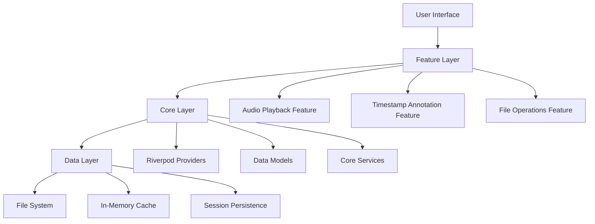
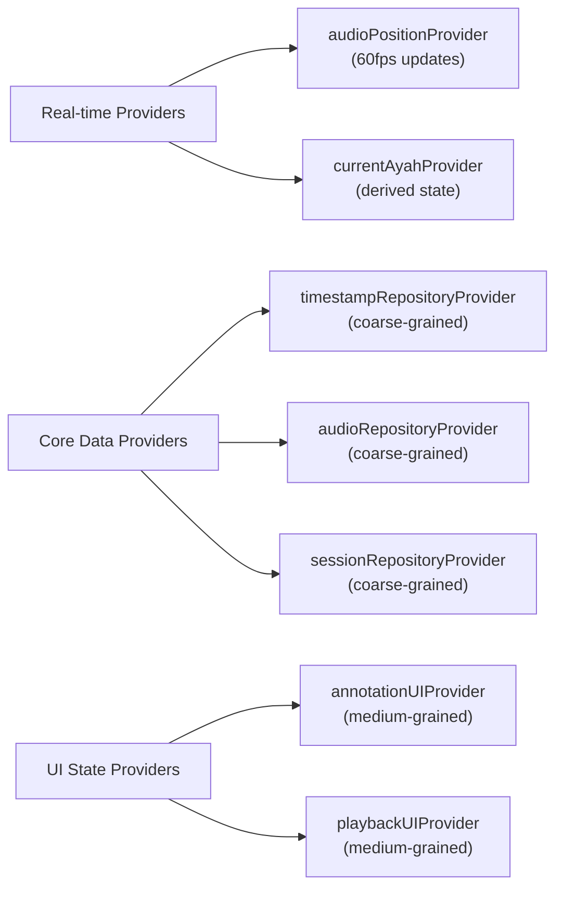
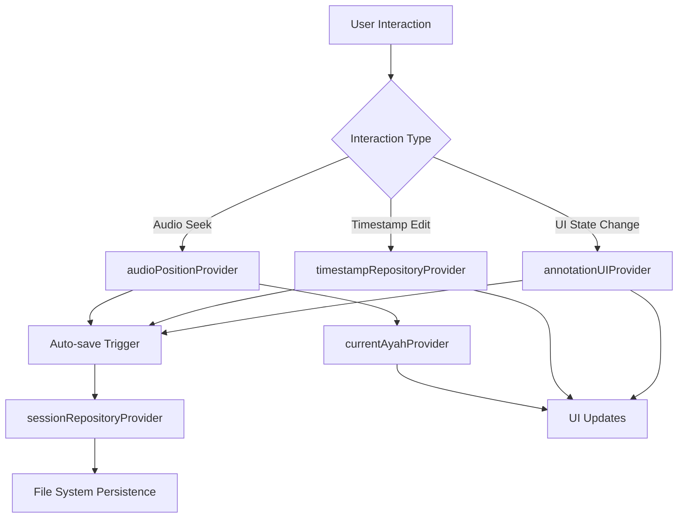
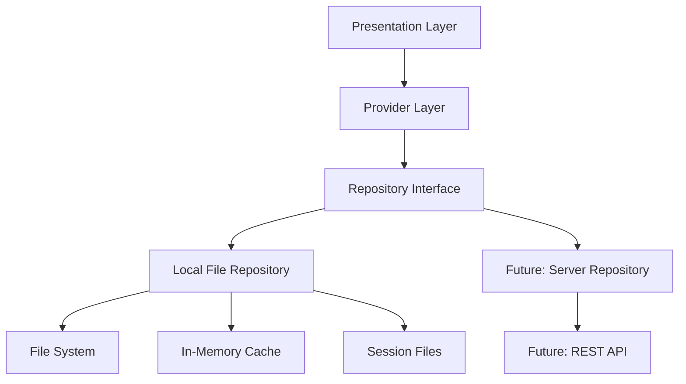
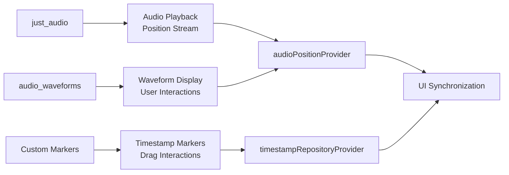
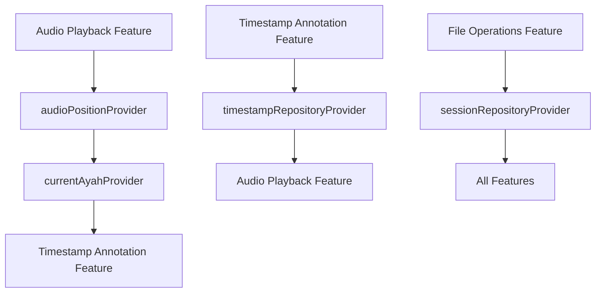

# Surah Annotator - Architecture Documentation

## Overview

The Surah Annotator is built using a **Feature-First Architecture** with **Riverpod state management**, designed to provide a scalable, maintainable, and performant solution for Quranic audio annotation. This document outlines the architectural decisions, patterns, and technical implementation strategy.

TOC:

- [Surah Annotator - Architecture Documentation](#surah-annotator---architecture-documentation)
  - [Overview](#overview)
  - [Architectural Principles](#architectural-principles)
    - [Core Philosophy](#core-philosophy)
  - [High-Level Architecture](#high-level-architecture)
  - [Folder Structure](#folder-structure)
  - [State Management Architecture](#state-management-architecture)
    - [Provider Granularity Strategy](#provider-granularity-strategy)
    - [Provider Responsibilities](#provider-responsibilities)
      - [Real-time Providers (Fine-grained)](#real-time-providers-fine-grained)
      - [Core Data Providers (Coarse-grained)](#core-data-providers-coarse-grained)
      - [UI State Providers (Medium-grained)](#ui-state-providers-medium-grained)
    - [Data Flow Pattern](#data-flow-pattern)
  - [Data Layer Architecture](#data-layer-architecture)
    - [Repository Pattern Implementation](#repository-pattern-implementation)
    - [Data Storage Strategy](#data-storage-strategy)
      - [Performance-Critical Data (In-Memory)](#performance-critical-data-in-memory)
      - [Persistent Data (File System)](#persistent-data-file-system)
      - [Auto-Save Strategy](#auto-save-strategy)
      - [Session Persistence Format](#session-persistence-format)
      - [Timestamp Files Available Formats](#timestamp-files-available-formats)
  - [Audio Processing Architecture](#audio-processing-architecture)
    - [Technology Stack](#technology-stack)
    - [Audio Component Integration](#audio-component-integration)
    - [Real-time Coordination](#real-time-coordination)
  - [Feature Communication Patterns](#feature-communication-patterns)
    - [Cross-Feature Data Flow](#cross-feature-data-flow)
    - [Domain Boundaries](#domain-boundaries)
  - [UI Framework \& Styling](#ui-framework--styling)
    - [Material Design 3 Foundation](#material-design-3-foundation)
    - [Responsive Design Considerations](#responsive-design-considerations)
  - [Performance Considerations](#performance-considerations)
    - [Optimization Strategies](#optimization-strategies)
    - [Critical Performance Paths](#critical-performance-paths)
  - [Testing Strategy](#testing-strategy)
    - [Minimal Testing Approach](#minimal-testing-approach)
  - [Future Extensibility](#future-extensibility)
    - [Planned Extensions](#planned-extensions)
    - [Architectural Support](#architectural-support)
  - [Development Guidelines](#development-guidelines)
    - [Code Organization Principles](#code-organization-principles)
    - [Adding New Features](#adding-new-features)
  - [Conclusion](#conclusion)


## Architectural Principles

### Core Philosophy
- **Domain-Driven Design**: Features are organized around business domains rather than technical layers
- **Separation of Concerns**: Clear boundaries between data, business logic, and presentation
- **Performance-First**: Optimized for real-time audio processing and smooth UI interactions
- **Future-Proof**: Designed to accommodate server integration and additional features

## High-Level Architecture



## Folder Structure

```
lib/
├── core/                           # Shared foundations
│   ├── models/                     # Data structures
│   │   ├── ayah_timestamp.dart
│   │   ├── audio_file.dart
│   │   ├── session_data.dart
│   │   └── word_timestamp.dart
│   ├── providers/                  # Hybrid granularity providers
│   │   ├── audio_position_provider.dart    # Real-time (fine-grained)
│   │   ├── current_ayah_provider.dart      # Real-time (fine-grained)
│   │   ├── timestamp_repository_provider.dart  # Core data (coarse)
│   │   ├── audio_repository_provider.dart      # Core data (coarse)
│   │   ├── session_repository_provider.dart    # Core data (coarse)
│   │   ├── annotation_ui_provider.dart         # UI state (medium)
│   │   └── playback_ui_provider.dart           # UI state (medium)
│   ├── repositories/               # Data access layer
│   │   ├── timestamp_repository.dart
│   │   ├── audio_repository.dart
│   │   └── session_repository.dart
│   └── services/                   # Core business services
│       ├── auto_save_service.dart
│       └── validation_service.dart
├── features/                       # Domain-driven features
│   ├── audio_playback/            # Pure audio playback logic
│   │   ├── widgets/
│   │   │   ├── waveform_display.dart
│   │   │   ├── audio_controls.dart
│   │   │   └── position_indicator.dart
│   │   └── services/
│   │       └── audio_service.dart
│   ├── timestamp_annotation/       # ALL timestamp-related functionality
│   │   ├── widgets/
│   │   │   ├── timestamp_cards.dart
│   │   │   ├── draggable_markers.dart      # Thin bars on waveform
│   │   │   ├── annotation_controls.dart
│   │   │   └── batch_edit_controls.dart
│   │   ├── services/
│   │   │   ├── timestamp_validation_service.dart
│   │   │   ├── conflict_resolution_service.dart
│   │   │   └── batch_edit_service.dart
│   │   └── utils/
│   │       ├── timestamp_formatter.dart
│   │       └── overlap_detector.dart
│   └── file_operations/            # File I/O and format handling
│       ├── widgets/
│       │   ├── file_picker_widget.dart
│       │   ├── upload_progress.dart
│       │   └── format_selector.dart
│       ├── services/
│       │   ├── file_loader_service.dart
│       │   └── file_saver_service.dart
│       └── adapters/               # Format support
│           ├── json_adapter.dart
│           └── format_adapter_interface.dart
├── shared/                         # Reusable UI components
│   ├── widgets/
│   │   ├── custom_buttons.dart
│   │   ├── dialogs/
│   │   └── loading_indicators.dart
│   ├── theme/
│   │   ├── app_theme.dart
│   │   ├── colors.dart
│   │   └── text_styles.dart
│   └── constants/
│       ├── app_constants.dart
│       └── file_paths.dart
└── main.dart
```

## State Management Architecture

### Provider Granularity Strategy

Our **Hybrid Granularity** approach balances performance with maintainability:



### Provider Responsibilities

#### Real-time Providers (Fine-grained)
- **audioPositionProvider**: Current playback position, updates 60fps during playback
- **currentAyahProvider**: Derived from position + timestamps, shows currently playing ayah

#### Core Data Providers (Coarse-grained)
- **timestampRepositoryProvider**: All timestamp CRUD operations, batch edits
- **audioRepositoryProvider**: Audio file loading, playback control
- **sessionRepositoryProvider**: Session persistence, auto-save coordination

#### UI State Providers (Medium-grained)
- **annotationUIProvider**: Sync mode, selected ayah, review states, pending changes
- **playbackUIProvider**: Waveform state, control states, UI interactions

### Data Flow Pattern



## Data Layer Architecture

### Repository Pattern Implementation



### Data Storage Strategy

#### Performance-Critical Data (In-Memory)
- Audio position (60fps updates)
- UI states (sync mode, selected ayah)
- Pending changes cache

#### Persistent Data (File System)
- Audio files (user uploads)
- Timestamp files (JSON format)
- Session files (user-accessible JSON)

#### Auto-Save Strategy
Auto-save triggers on:
- Audio seek (user clicked waveform)
- Timestamp edit (marker drag or manual edit)
- Review status change

#### Session Persistence Format
```json
{
  "sessionId": "uuid",
  "audioFile": "path/to/audio.mp3",
  "timestampFile": "path/to/timestamps.json",
  "currentPosition": "00:02:45",
  "lastAyah": 15,
  "unsavedChanges": [],
  "uiState": {
    "syncMode": true,
    "reviewedAyahs": [1, 2, 3]
  }
}
```

#### Timestamp Files Available Formats

Currently, the application supports **JSON format only** for timestamp files. The expected file structures are:

**ayah_timestamps.json**:
```json
[
  {
    "ayah_number": "integer - Sequential ayah number within the surah",
    "start_time": "number - Start timestamp in seconds (decimal precision)",
    "end_time": "number - End timestamp in seconds (decimal precision)", 
    "text": "string - Arabic text of the ayah"
  }
]
```

**word_timestamps.json** (optional):
```json
[
  {
    "start": "number - Start timestamp in seconds (decimal precision)",
    "end": "number - End timestamp in seconds (decimal precision)",
    "word": "string - Individual Arabic word"
  }
]
```

**Format Notes**:

- All timestamps are in seconds with decimal precision
- Word timestamps should cover the complete audio from first word to last word
- Words should be in sequential order matching the audio timeline
- Future support planned for additional formats (SRT, TXT) via adapter pattern

## Audio Processing Architecture

### Technology Stack
- **just_audio**: Reliable audio playback and seeking
- **audio_waveforms**: Interactive waveform visualization with gestures
- **Custom overlay widgets**: Draggable timestamp markers

### Audio Component Integration



### Real-time Coordination
- Audio position updates at 60fps
- Waveform progress visualization
- Timestamp marker positioning
- Word highlighting when available

## Feature Communication Patterns

### Cross-Feature Data Flow



### Domain Boundaries
- **Audio Playback**: Handles pure audio operations and waveform display
- **Timestamp Annotation**: Handles ALL timestamp-related functionality (including waveform markers)
- **File Operations**: Handles file I/O, format conversion, and future server integration

## UI Framework & Styling

### Material Design 3 Foundation
- **Primary Framework**: Flutter Material 3 widgets
- **Custom Components**: Only when Material widgets are insufficient
- **External Packages**: For highly specialized components (waveform, file picker)
- **Theming**: Centralized theme configuration with ColorScheme

### Responsive Design Considerations
- Tablet-friendly layouts for timestamp editing
- Adaptive UI components
- Efficient list rendering for large ayah collections

## Performance Considerations

### Optimization Strategies
- **Provider Granularity**: Minimize unnecessary widget rebuilds
- **Audio Processing**: Efficient waveform data caching
- **File I/O**: Lazy loading of large audio files
- **Memory Management**: Automatic cleanup via Riverpod

### Critical Performance Paths
- Audio position updates (60fps)
- Waveform rendering during playback
- Timestamp marker dragging
- Large file processing

## Testing Strategy

### Minimal Testing Approach
**Phase 1 (Current)**: Focus on shipping quickly
- Manual testing during development
- Basic widget tests for critical UI components
- Integration tests for main user flows

**Phase 2 (Future)**: Expand test coverage
- Unit tests for business logic
- Provider testing with mocks
- Comprehensive integration testing

## Future Extensibility

### Planned Extensions
- **Server Integration**: REST API for audio processing
- **Multiple File Formats**: srt/txt support for timestamp files
- **YouTube Integration**: Direct video URL processing

### Architectural Support
- Repository pattern enables easy server integration
- Adapter pattern supports multiple file formats
- Feature-first structure allows independent feature development
- Provider architecture scales with complex state requirements

## Development Guidelines

### Code Organization Principles
1. **Feature Isolation**: Each feature should be developable independently
2. **Single Responsibility**: Each provider/service has one clear purpose
3. **Dependency Injection**: Use Riverpod for all dependency management
4. **Error Handling**: Consistent error handling across all layers

### Adding New Features
1. Create new feature folder under `features/`
2. Define required providers in `core/providers/`
3. Implement repositories if new data access needed
4. Create feature-specific services and utilities
5. Build UI components using Material 3 foundation

## Conclusion

This architecture provides a solid foundation for the Surah Annotator that prioritizes:
- **Developer Experience**: Clear structure and separation of concerns
- **Performance**: Optimized for real-time audio and smooth interactions
- **Maintainability**: Feature-first organization with clean dependencies
- **Scalability**: Easy to add new features and integrate with external services

The hybrid granularity provider strategy ensures optimal performance for real-time features while maintaining simplicity for UI state management. The domain-driven feature boundaries create a natural organization that matches the application's core